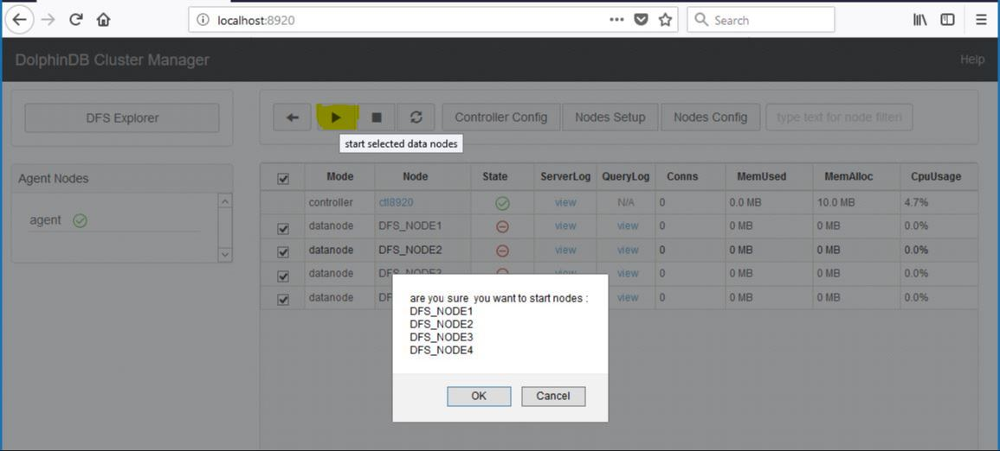

# DolphinDB 单物理节点集群部署

DolphinDB Cluster包括三种类型节点：数据节点（data node），代理节点（agent）和控制节点（controller）。
  *  data node用于数据存储，查询以及计算
  *  agent用于关闭开启data node
  *  controller用于集群管理

#### 1. 下载
从DolphindB网站下载DolphinDB，并解压到一个指定目录。例如解压到如下目录：

```
/DolphinDB
```

#### 2. 软件授权许可更新

如果用户拿到了企业版试用授权许可，只需要把如下文件替换成新的授权许可即可。每个物理节点的license文件都需要更新。与社区版本相比，企业版支持更多的节点，CPU内核和内存。

```
/DolphinDB/server/dolphindb.lic
```

#### 3. DolphinDB集群初始配置

启动一个集群，必须配置控制节点和代理节点。数据节点可以在集群启动后通过web界面来配置，当然也可以在初始阶段手工配置。


#### 3.1.  配置控制节点

在配置集群的时候请核对授权文件规定的节点个数，每个节点最多内核和最大内存限制。如果配置超出授权文件规定，集群或节点将无法正常启动。这些异常信息都会记录在log文件中。

进入server子目录。在server目录下，以Linux为例，创建config, data, log 子目录。 DolphinDB缺省情况下会将server所在目录作为home目录，所有的配置文件和log文件也都会放在home目录下面。为了便于管理，本教程创建了如下目录来分别存放这些内容，但是这不是必须的。

```
cd /DolphinDB/server/

mkdir /DolphinDB/server/config
mkdir /DolphinDB/server/data
mkdir /DolphinDB/server/log
```

#### 3.1.1 配置控制节点的参数文件
在config目录下，创建controller.cfg文件，并填写如下内容。用户可根据实际情况，调整参数。 Controller的主要用途是管理集群节点。本教程controller.cfg里面定义了集群管理的常用参数。

```
localSite=localhost:8920:ctl8920
localExecutors=3
maxConnections=128
maxMemSize=16
webWorkerNum=4
workerNum=4
dfsReplicationFactor=1
dfsReplicaReliabilityLevel=0
```

以下是对这些参数的解释


| 参数配置        | 解释          |
|:------------- |:-------------|
|localSite=localhost:8920:ctl8920 |节点局域网信息,格式为 IP地址:端口号:节点别名，所有字段都是必选项。|
|localExecutors=3  |                 本地执行者的数量。默认值是CPU的内核数量 - 1。|
|maxConnections=128         |        最大向内连接数。|
|maxMemSize=16    |                 最大内存数量。|
|webWorkerNum=4  |                   处理http请求的工作池的大小。默认值是1。|
|workerNum=4          |              常规交互式作业的工作池大小。默认值是CPU的内核数量。|
|dfsReplicationFactor=1     |        每个表分区或文件块的副本数量。默认值是2。|
|dfsReplicaReliabilityLevel=0 |      多个副本是否可以驻留在同一台物理服务器上。 0：是; 1：不。默认值是0。|


#### 3.1.2 配置集群成员参数文件

在config目录下，创建cluster.nodes文件，并填写如下内容。用户可根据实际情况，调整参数。cluster.nodes用于存放集群数据/计算节点信息。本教程使用4个节点，用户可根据授权证书更改节点个数。该配置文件分为两列，第一例存放节点IP地址，端口号，和节点别名。这三个信息由冒号“：”分隔。第二列是说明节点类型。比如agent节点，类型为agent,
而数据节点类型为data node. 这里是大小写敏感的。

```
localSite,mode
localhost:8910:agent,agent
localhost:8921:DFS_NODE1,datanode
localhost:8922:DFS_NODE2,data node
localhost:8923:DFS_NODE3,datanode
localhost:8924:DFS_NODE4,datanode
```
#### 3.1.3 配置数据节点参数文件
在config目录下，创建cluster.cfg文件，并填写如下内容。用户可根据实际情况，调整参数。cluster.cfg用于存放集群数据/计算节点需要的参数。例如下面定义的参数说明集群上每个节点都使用相同的配置。

```
maxConnections=128
maxMemSize=32
workerNum=8
localExecutors=7
webWorkerNum=2
```

#### 3.2 配置代理节点参数文件

在config目录下，创建agent.cfg文件，并填写如下内容。用户可根据实际情况，调整参数。DolphinDB Agent的用途是启动关闭节点。  本教程agent.cfg里面定义了agent的常用参数。

```
workerNum=3
localExecutors=2
maxMemSize=4
localSite=localhost:8910:agent
controllerSite=localhost:8920:ctl8920
```
#### 3.3. DolphinDB集群启动

#### 3.3.1 启动代理节点

在server目录即可执行文件所在目录运行以下命令行。注意到agent.log存放在log子目录下，如果出现agent无法正常启动的情况，可以根据此log file来诊断错误原因。

##### 建议通过linux命令**nohup**（头） 和 **&**（尾） 启动为后台运行模式，这样即使断开程序，也会照常运行。 console默认是开启的，如果要设置为后台运行，必须要设置为0，否者nohup的log文件会占用很大磁盘空间。“-mode”表示节点启动为agent模式，“-home”指定数据以及元数据存储路径，“-config”指定配置文件路径，“-logFile”指定log文件路径。

#### 启动为后台模式
```
nohup ./dolphindb -console 0 -mode agent -home data -config config/agent.cfg -logFile log/agent.log &
```

#### 启动为前端交互模式

```
./dolphindb -mode agent -home data -config config/agent.cfg -logFile log/agent.log
```

#### Windows
```
dolphindb.exe -mode agent -home data -config config/agent.cfg -logFile log/agent.log
```

#### 3.3.2 启动控制节点

在server目录即可执行文件所在目录运行以下命令行。注意到controller.log存放在log子目录下，如果出现agent无法正常启动的情况，可以根据此log file来诊断错误原因。

#### Linux

#### 启动为后台模式
```
nohup ./dolphindb -console 0 -mode controller -home data -config config/controller.cfg -clusterConfig config/cluster.cfg -logFile log/controller.log -nodesFile config/cluster.nodes &
```

#### 启动为前端交互模式
```
./dolphindb -mode controller -home data -config config/controller.cfg -clusterConfig config/cluster.cfg -logFile log/controller.log -nodesFile config/cluster.nodes
```

#### Windows
```
dolphindb.exe -mode controller -home data -config config/controller.cfg -clusterConfig config/cluster.cfg -logFile log/controller.log -nodesFile config/cluster.nodes
```

#### 3.3.3 如何关闭代理节点和控制节点

如果是启动为前端交互模式，可以在控制台中输入"quit"退出

```
quit
```

如果是启动为后台交互模式，需要用linux系统kill命令。假设运行命令的linux系统用户名为 "ec2-user"
```
ps aux | grep dolphindb  | grep -v grep | grep ec2-user|  awk '{print $2}' | xargs kill -TERM
```

#### 3.3.4 启动和关闭数据节点

在controller和agent节点都启动的前提下，数据节点的开启和关闭可以通过DolphinDB提供的集群和管理界面。下一节有详细介绍。

进入集群Web管理界面。到浏览器中输入(目前支持浏览器为chrome, firefox)：

```
 localhost:8920 (8920为controller的端口号)
```


#### 3.3.5 DolphinDB权限控制

DolphinDB提供了良好的安全机制。非系统管理员没有权限做集群部署。DolphinDB默认的系统管理员信息如下。在使用DolphinDB网络集群管理平台的时候，需要用该账号登录才能进行集群管理。

```
系统管理员帐号名: admin
默认密码        : 123456
```

点击登录链接


输入管理员用户名和密码


#### 3.3.6 启动数据节点

全选所有数据节点之后，点击执行图标，并确定。然后，点击刷新图标来查看状态。有的时候，尤其刚关闭完节点，重新启动之后，需要多执行几次才能启动。主要原因是操作系统没有释放资源。
如果出现长时间无法正常启动，请查看log目录下该即诶但的logFile. 如果节点名字是DFS_NODE1，那对应的logFile应该在 log/DFS_NODE1.log。
常见节点无法正常启动原因包括:1)超出授权证书规定节点数、内存大小、以及核的数目。如果出现这种情况，logFile中会有明确说明；2)数据文件破坏。这种情况要依据logFile出错信息，具体情况具体分析。



成功启动后，State列会用绿色对号显示成功启动。


#### 4. 基于Web的集群管理

经过上述步骤，我们已经成功部署DolphinDB Cluster. 在实际使用中我们经常会遇到需要更改参数配置，增加数据节点等等。DolphinDB的网络界面提供配置DolphinDB集群的所有功能。
#### 4.1. 控制节点参数配置

点击按钮Controller Config会弹出一个控制界面，这里的localExectors, maxConnections, maxMemSize,webWorkerNum以及workerNum正式我们在创建controller.cfg（见3.3）的时候手动填写的。注意不要修改controller的localSite，否则由于agent中关于controller的配置信息没有改变，会造成集群无法正常运行。
这些配置信息可以通过Controller Config这个界面来更改。配置会在重启controller之后生效。


#### 4.2. 增删数据节点

点击按钮Nodes Setup,会进入集群节点配置界面。下图显示的配置信息是我们在3.5中手动创建的cluster.nodes中的信息。使用nodes setup可以进行添加删除数据节点。新的配置会在整个集群重启之后生效:关闭所有data nodes，关闭agent nodes，关闭controller；重启集群。另外需要注意，如果节点上已经存放数据，删除节点有可能会造成数据丢失。


#### 4.3. 修改数据节点参数
点击按钮 Nodes Config, 进行数据节点配置。这些信息是我们在3.6中手动创建cluster.cfg中的信息。除了这些参数之外，用户还可以根据实际应用在这里添加配置其它参数。重启所有节点后即可生效。


#### 5. DolphinDB 集群详细配置以及参数意义

中文

http://dolphindb.com/cn/help/Newtopic47.html

英文

http://dolphindb.com/help/ClusterSetup.html
