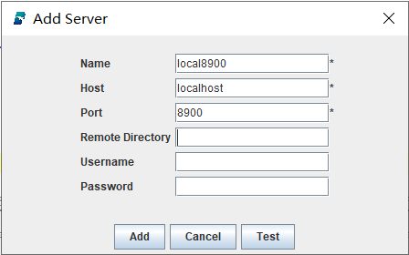
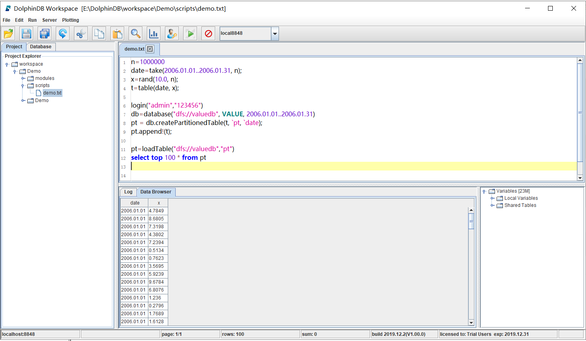

# DolphinDB Single Node Deployment

Download DolphinDB from [DolphinDB](http://www.dolphindb.com/downloads.html) website and extract it to a directory. For example, extract it to the following directory:

```
/DolphinDB
```

## 1. Update License File 

If you have obtained the Enterprise Edition license, please use it to replace the following file:

```
/DolphinDB/server/dolphindb.lic
```
Otherwise, you can continue to use the community version of DolphinDB, which allows up to 4GB of memory use. 

## 2. Run DolphinDB Server

Go to folder /DolphinDB/server/ and run dolphindb executable. 

- Linux:

First, modify the file permissions:
```sh
chmod +x dolphindb
```

Linux console mode: 
```
./dolphindb
```
Linux background mode: 
```
nohup ./dolphindb -console 0 &
```

In Linux, we recommend starting in the background mode with Linux command **nohup** (header) and **&** (tail). Even if the terminal is disconnected, DolphinDB will keep running. "-console" is set to 1 by default. To run in the background mode, please set it to 0 ("-console 0"). Otherwise, the system will quit after running for a while. 

- Windows: 

Execute dolphindb.exe

The default port number of the system is 8848. To change it (e.g., to 8900), use the following command line:

Linux:
```
./dolphindb -localSite localhost:8900:local8900
```
Windows:
```
dolphindb.exe -localSite localhost:8900:local8900
```

The license file specifies the maximum amount of memory that DolphinDB can use. Users can lower the limit by specifying the configuration parameter -maxMemSize (in units of GB) when starting DolphinDB. 

Linux:
```
./dolphindb -localSite localhost:8900:local8900 -maxMemSize 32
```
Windows:
```
dolphindb.exe -localSite localhost:8900:local8900 -maxMemSize 32
```

## 3. Connect to DolphinDB Server in DolphinDB GUI

### 3.1 Download the [DolphinDB GUI package](http://www.dolphindb.com/downloads.html)

Unzip the package to a directory. For example, unzip it to /DolphinDB_GUI. 

### 3.2 Start GUI 

In Linux,  execute the following command to start GUI:
```sh
sh gui.sh
```
In Windows, double click gui.bat to start GUI. 

If DolphinDB GUI cannot start normally, most likely it's because of one of the following 2 reasons:
- Java is not installed.
- DolphinDB GUI requires Java 8 or above. If the installed Java version is lower than 8, please [download](https://www.oracle.com/technetwork/java/javase/downloads/index.html) a new version of Java. 

### 3.3 After starting GUI

Follow the prompts to select a folder as the workspace. 

Click "Server" in the menu bar to add a server or edit servers:




Use the drop-down box at the right side of the toolbar to select the DolphinDB server where the script is to be executed:


#### 4. Run DolphinDB script in GUI

In the "Project Explorer" panel on the left side of the DolphinDB GUI, right click "workspace" and select "New Project" to create a new project:


Clik on the small dot to the left of the newly created project to expand folders, then right click on the folder "scripts", choose "New File", enter the new file name demo.txt. 

Now we are ready to write DolphinDB script. Enter the following script in the editor panel:
```txt
n=1000000
date=take(2006.01.01..2006.01.31, n);
x=rand(10.0, n); 
t=table(date, x);

login("admin","123456")
db=database("dfs://valuedb", VALUE, 2006.01.01..2006.01.31)
pt = db.createPartitionedTable(t, `pt, `date);
pt.append!(t);

pt=loadTable("dfs://valuedb","pt")
select top 100 * from pt
```
Click the  button in the toolbar to execute the script. The following figure shows the result of the operation:




By default, database files are stored under the directory of /server/local8848. To change the directory, please specify the configuration parameter 'volumes'. 

## 5. Change configuration 

There are 2 ways to change single-node mode configuration parameters:

- update the configuration file dolphindb.cfg. 

- Specify configuration parameters in the command line when starting the node. For example, change the port number to be 8900 and the maximum memory to be 4GB:

Linux:
```sh
./dolphindb -localSite localhost:8900:local8900 -maxMemSize 4
```

Windows:
```sh
dolphindb.exe -localSite localhost:8900:local8900 -maxMemSize 4
```
